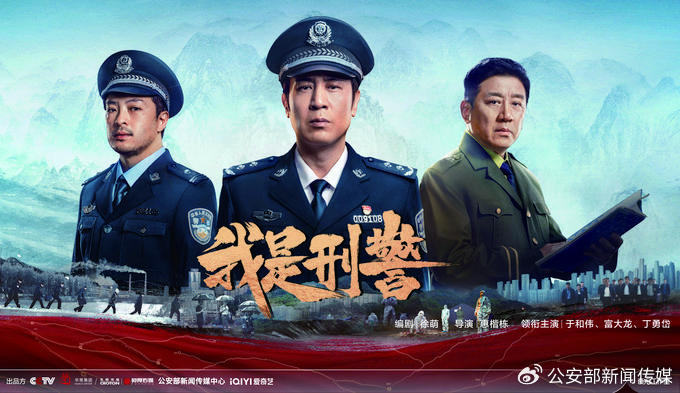
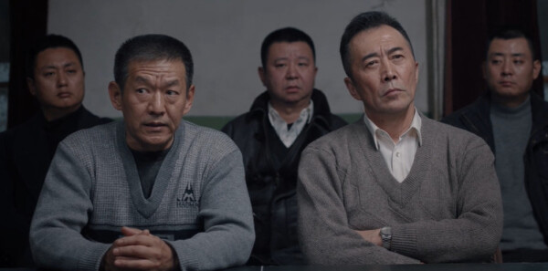

# 父子教育手札｜《我是刑警》观影记录：把“破案”变成做事方法

**时间**：【2026年2月】
**地点**：家里/托管后晚饭后
**对象**：我与儿子（8–9岁）
**片名**：《我是刑警》
**主题**：线索、方向、坚持与复核

------

这段时间，儿子对破案题材格外着迷。《我是刑警》对他有一种稳定的吸引力：不是追求“刺激”，更像是在追一种“从乱到清”的秩序感——线索一点点出现，真相一点点逼近，最后世界重新变得可理解。

那天我们约定：**不把它当“剧”，当成一次“办案演练”。**
我提前跟他说规则很简单：
1）只讨论“看得见的线索”，不凭感觉定人；
2）至少提出两个可能；
3）方向可以选，但必须能被证据改变。

------

## 一、观影中：我们怎么“办案”

### 1）重现场：先把“发生了什么”说清楚

我让他用三句话复述剧情，不准加判断。

他复述得很干净：

- “发生了什么事？”
- “在哪里发生？”
- “现在警方掌握了哪些信息？”

我发现他最擅长抓“动作性事实”（谁做了什么），但容易忽略“时间线”和“规则线索”（先后顺序、程序流程）。于是我只补一句：

> “加一条：时间顺序怎么排？”

他立刻开始把信息按先后摆出来，眼神明显更专注了——就像把散落的拼图边框先拼好。

### 2）穷尽线索：线索不是越多越好，是“可验证”

我们把线索分成三类写在纸上：

- **物证**：能看见、能查到、能对照的
- **口供**：谁说的、可能偏差在哪里
- **行为**：某个动作是否符合动机与风险

儿子有个很可贵的点：他愿意“找细节”，但也容易被某个细节带走。于是我引导他加了一句“线索等级”：

> “这个线索是关键证据，还是只是气氛证据？”

他想了想，把一些“看起来很像”的东西降级了。这一步很重要：**孩子开始学会给信息加权，而不是被信息牵着跑。**

### 3）定方向：方向重要，但方向只是“当前最优假设”

我们用了一个很像“侦探游戏”的做法：让他在纸上写三个假设。

- 假设A：……（理由）
- 假设B：……（理由）
- 假设C：……（理由）

然后让他选主方向，但必须写上“置信度”：比如 60%、70%。

我提醒他一句话：

> “方向要坚守执行，但结论不能死守。证据变了就改。”

他点点头，说：“那我先按A查。”

那一瞬间我意识到：他喜欢的不是“抓到坏人”，而是**做出一个可被检验的判断**。这是非常好的学习底层能力。

------

## 二、我们总结的“破案式做事法”

观影结束后，我们把方法浓缩成一段“父子公约”（儿子自己也参与措辞）：

**做任何事都和破案一样：**

- 开始要重现场，线索要细致穷尽；
- 再根据线索分析走向，制定破案方向；
- 方向的确定至关重要；
- 之后要坚守方向，穷尽办法推进，不能遇到困难就撒胡椒面，不能轻易换方向。
  **很多积案死案，就是这几方面做得不够。**

我在旁边加了两条“保险丝”，避免“坚守方向”变成“固执方向”：

1）**坚守执行，不坚守结论。**
2）设复核点：出现明显反证，就回到线索板重开假设。

儿子听完说：“那就像游戏里的存档点，到了就看一下走对没走对。”——他用自己的语言理解了“复核点”，这比我讲道理有效得多。

------

## 三、把《我是刑警》用在学习与兴趣项目上

当晚我们就约定了两种“迁移用法”，不讲大道理，只上工具。

### 用法A：学习“开案三步”（每天可用）

1）复述题目现场（题目在说什么）
2）列线索（已知/未知/限制条件）
3）列两种解法假设（至少两个方向）

只要这三步写出来，后面再算再错都不可怕。因为错的是“某一步”，不是“我不行”。

### 用法B：兴趣项目“1主1备”（避免撒胡椒面）

- 同时只推进 **1个主方向 + 1个备方向**
- 所有想法先放“线索池”，到复核点再升级
- 每个动作都要回答：“我这是在验证哪个假设？”

这是工程思维，也是破案思维：**行动必须指向证据。**

------

## 四、当晚的一个小观察

儿子在“等待/无目标”的场景更容易显得低兴致，但一旦进入“有目标、能推进、能看到反馈”的任务，他会安静地投入——不是兴奋外放型，而是“把劲儿用在行动上”的类型。

这让我更确信：与其催他“快点”“认真点”，不如先帮他把事情变成**可重现场、可列线索、可选方向、可验证**的任务。孩子不是不努力，很多时候只是**不知道从哪里下手**。

------

## 五、下一次我们想试的“亲子办案仪式”

- 观影后 5 分钟：写一张“案件卡”（线索3条、假设2条、方向1条）
- 每周一次：把一张错题当成“积案”复盘（嫌疑人：读题/漏条件/方法/计算/验证）
- 每个兴趣项目：做一张“项目案件板”（事实/假设/行动/证据）

我们不追求做得多，只追求做得**可复盘、可迁移**。

------

这次《我是刑警》对我们来说不只是消遣，它像一把钥匙：把“破案”的兴奋感，转化成孩子能用一辈子的做事方法。下一次，我们还想把这把钥匙用在更具体的地方——一道数学题、一个小电路、或者一个小程序——让他体验：**真相不是靠灵感，是靠证据一步步逼近。**