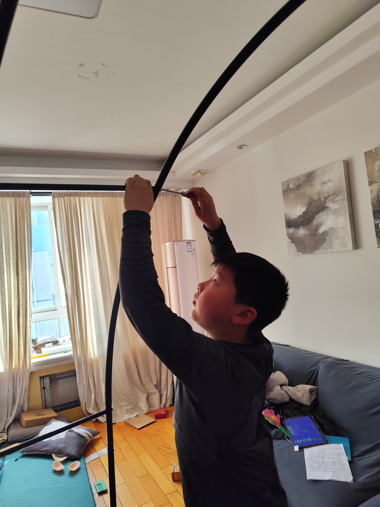
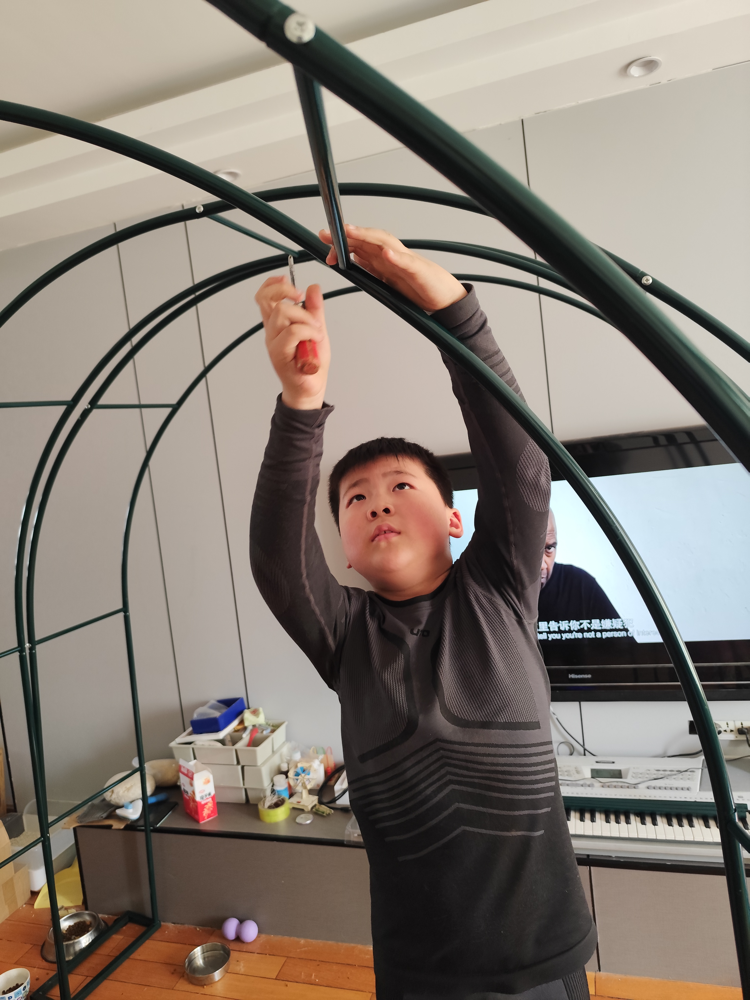

### 屋顶花园工程 1.0

寒假前，我其实准备了一些电子小套件，想着假期里可以和儿子一起做点小实验。
结果寒假里工作一直很忙，这些小东西一直放在桌子上，没有动。

多少有点遗憾。

不过寒假里，我们还是一起做了一件事。

我家屋顶有个小花园，原来的花架时间久了，已经塌掉了。
我买了一个新的金属花架，打算重新搭起来。

那天我把零件搬到客厅，开始组装。
儿子很自然地就过来了。

我给他一把螺丝刀，让他帮我扶着杆子、对孔、拧螺丝。

很多连接点在头顶，他需要把手举得很高。
有时候还要一只手扶着结构，一只手慢慢把螺丝旋进去。

他做得很认真。

我们一点点把弧形的钢管连接起来。
从一根、两根，到慢慢形成一个完整的拱形结构。

最后整个花架装好时，其实已经不小了。

我们两个人一起抬着它，从屋里搬出去，再搬到屋顶。

那一刻我忽然觉得，这件事其实比原来计划做的小电子项目更真实一点。

不是做完就收进盒子的玩具，
而是家里真的会用到的东西。

过些天花藤长起来的时候，这个架子就会被绿色慢慢爬满。

而这个架子，是我们两个人一起装起来的。

孩子很多年以后也许不会记得具体是哪一天，
但他可能会记得：

有一次，他和爸爸一起，用螺丝刀把一个很大的花架搭了起来。

