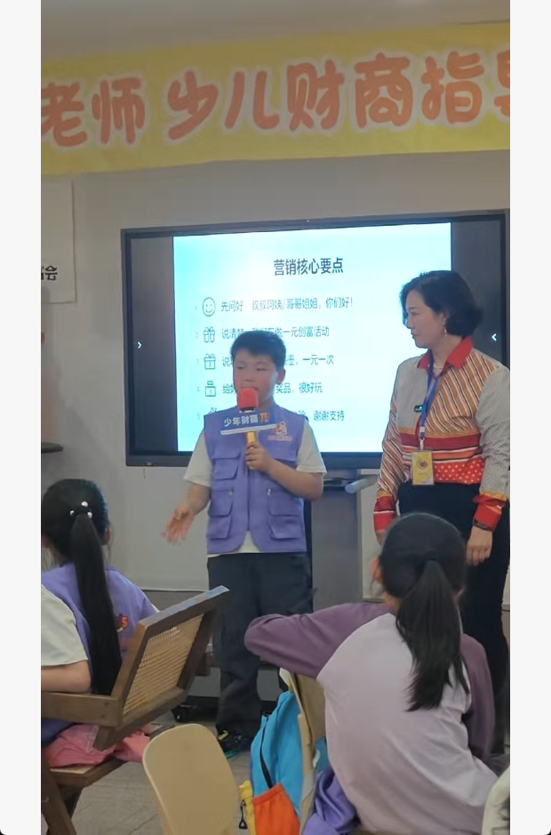

# 父子教育手札｜第十二则：第一次站到陌生人面前

## 时间地点

2026年4月18日下午，郑州东区金融岛。

## 事件

儿子参加了一场关于财商的活动。活动开始时，老师先做集中培训。培训结束后，孩子们被分成两组，各自去向陌生人介绍一个套圈活动，争取让对方体验并付费参与。活动最后，大家又一起做总结复盘。

这天下午，他一个人一共给三十多个成年人讲过。  
实际说动了两个人愿意尝试，其中一个免费体验之后没有继续付费，所以最后真正成交的是一个。

中途他也会累，会坐下来休息。  
还有一个队友小姑娘说他“干一会儿就去玩”，这让他有点不高兴，也因此不喜欢那个小姑娘。

活动过程中，他还认识了一个外地来的小朋友。两个人互相加了电话手表好友，到了第二天还打电话联系。

最后，他们小组总共销售了86个，另一组销售了106个。

他后来还注意到，有一个队友卖了5个。那个队友的方法是，专门去找带小孩的人推销。

## 父亲观察

这件事最让我在意的，不是最后成交了几个，而是他真的敢一次次走到陌生人面前开口。

一个孩子，独自去给三十多个成年人讲一件事，本身就已经很不简单。很多成年人也未必做得到。真正难的，不是最后有没有成交，而是敢不敢迈出第一步，被拒绝之后还能不能继续讲下去。

所以我接他的时候对他说：  
**你能一个人去给三十多个陌生人讲，这已经很强悍了，99%的人都做不到。**

这不是安慰，而是事实。

老师们后来也对他印象深刻，觉得他很不简单。我想，别人看到的，也不只是结果，而是他身上那股愿意开口、愿意坚持的劲头。

这次活动里，我也看到了孩子成长里很真实的几个侧面：  
他会累，会休息；  
他会在意别人怎么评价他；  
他会因为一句不中听的话而产生情绪；  
他也会因为遇到投缘的人而主动建立友谊。

这些都不是题外话。它们本身就是成长的一部分。

## 当次收获

这次活动至少让他碰到了几件很重要的事。

第一，真正去面对陌生人。  
不是在熟悉的环境里表达，而是走到真实世界里，向不认识的人开口。

第二，开始承受拒绝。  
愿意听的人很少，愿意停下来的人更少，愿意付费的人更少。真实世界里，本来就不是每次努力都会立刻换来结果。

第三，开始观察方法。  
他已经不只是埋头去做，而是开始注意卖得多的人是怎么卖的，并且看到了一个很直接的经验：找带小孩的人，更容易成交。

第四，开始理解“销售”不是只靠热情。  
它还包括判断对象、选择人群、调整表达，以及在一次次碰壁之后继续尝试。

第五，这次活动不只是销售训练，也是一次社会化练习。  
他交到了一个外地朋友，第二天还继续联系。这说明他在向外走，也在学习和更大的世界建立连接。

## 留给未来的话

等你以后长大，再回头看这一天，也许不会记得当时具体说了什么，卖了几个，别人是怎么拒绝你的。

但我希望你会记得，你曾经有过这样一个下午：

你年纪很小，  
心里也未必不紧张，  
腿也会累，  
被人说了也会不高兴，  
可你还是站到了陌生人面前，认真把自己的话讲了出来。

成交一个，当然值得高兴。  
但比成交更重要的，是你已经开始学会面对陌生人，面对拒绝，面对比较，也开始学着观察别人为什么做得更好。

一个人真正的成长，常常不是一下子赢得多漂亮，  
而是在不确定里，还是敢往前走一步。

这一步很小。  
但很多年以后回头看，往往正是这样的小步子，慢慢把人带向更远的地方。

[总结时候的视频](./images/金融岛财商/47a04f9dbc22ceea6d5d14a534627daa.mp4)